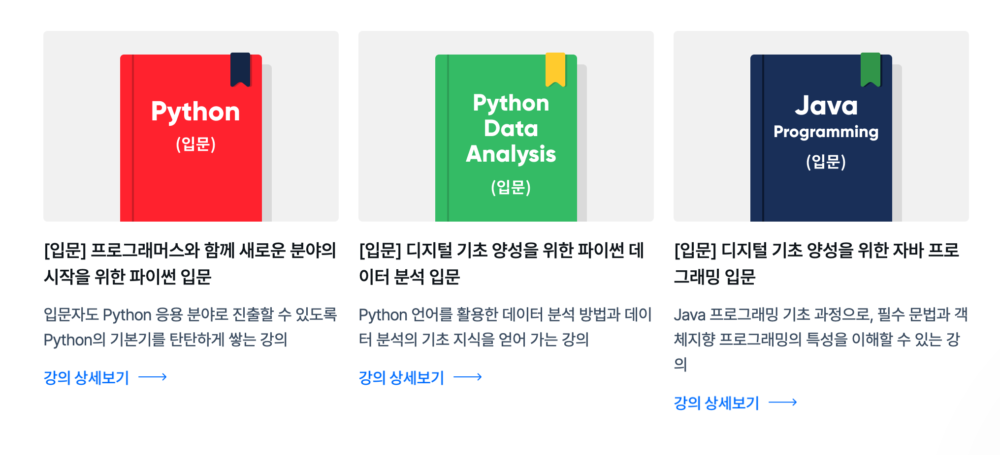
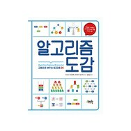
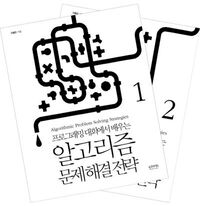

# 비전공자의 개발자 취업, 실용적인 준비 방법

## 개발자가 되는 데는 거창한 이유가 필요 없다.
가벼운 이야기부터 시작해보도록 할까요? '왜 개발자가 되었나?'는 특히 비전공자가 개발자로 전향을 하게 된다면 많이 맞닥뜨리는 질문입니다.  
사람마다 개발자가 되려하는 이유는 다양할 것입니다.  
누구는 필자와 같이 돈을 잘 벌고 싶어서(물론 아직 달성하지 못했지만), 누군가는 마치 기계를 조립하듯 코드를 작성하는 과정이 재밌어서,  
또 누군가는 기술을 통해 이 세상에 혁신을 가져오고 싶어서와 같이 위대한 이유 때문일 것입니다.  

하지만 개발자가 되는데 반드시 특별한 이유가 필요한 것은 아닙니다. 내가 앞으로 최소 주40시간씩은  
코드와 (혹은 그 관련된 업무와) 씨름할 수 있는 책임감이 있고, 그 안에서 나름의 만족감을 느낄 수 있다면 충분하다고 생각합니다.

## 시작은 코딩 부트캠프를 추천

비전공자가 개발자가 되는 방법은 크게 코딩 부트캠프를 수료하는 것과 독학/과외 두 가지가 있습니다.  
하지만 독학은 잘못된 커리큐럼을 짤 확률이 높습니다. 이제 막 프로그래밍을 시작한 입장에서 무엇이 중요한지 알기 힘들기 때문입니다.  

반면 부트캠프는 대체로 **실무와 밀접한 커리큐럼**으로 이루어져있습니다.  
또한 **국비지원을 활용하면 부트캠프를 무료로 수료**할 수 있다는 것도 큰 장점입니다.  
무엇보다 부트캠프를 추천하는 가장 큰 이유는 진행하는 부트캠프에서 진행하는 프로젝트 때문입니다.  
**동료들과 팀웍을 발휘하고, 어설프지만 설계부터 배포까지 해내는 것**은 부트캠프에서 얻을 수 있는 소중한 경험입니다.

###### *위와 같이 많은 코딩 부트캠프들이 운영되고 있다 있다.*

## 수료 후에는 어떻게 준비하는 것이 좋을까?
부트캠프 수료 후에는 어떻게 준비하는 것이 좋을까요? 먼저 비전공자로서 부족한 점이 분명히 존재합니다.  
전공자들이 4년간 대학에서 두꺼운 전공책과 씨름하고 시험을 준비하며 쏟았던 노력을 무시할 수는 없기 때문입니다.

그렇다면 비전공자로서 취업전선에 뛰어들기 위해 그와 동등한 과정을 겪어야 한다는 것일까요? 저는 꼭 그렇지는 않다고 생각합니다.  
여기에 제가 생각하는 현실적인 대안이 있습니다.

### 1. 비전공자로서 부족한 것 채우기 - IT 지식
개인적으로 비전공자로서 가장 어려움을 느꼈던 부분 중 하나는 각종 IT 용어와 지식이었습니다.  
특히 비전공자이며 평생을 개발과 관련없는 삶을 살았다면 이러한 것들이 매우 낯설 수 밖에 없습니다.  

예를 하나 들어보겠습니다. IT 업계에서 자주 쓰이는 "프로토콜"이라는 용어는 비전공자에게 어디선가 들어봤지만 와닿지 않는 무언가입니다.  
그런데 프로토콜을 모른다면 HTTP가 무엇인지 이해하기 힘들어집니다. 이렇듯 IT 지식은 서로 연결되어 있기도 합니다.

여기서 제가 추천하는 방법은 **얇고 넓게** 익히기 입니다. 물론 깊고 넓게 익히면 더할나위 없이 좋습니다.  
하지만 우리는 주어진 자원(시간과 집중력 등)내에서 효율성의 문제를 간과할 수 없습니다. 프로토콜 얘기로 돌아가 보겠습니다.  
통신 시스템이 어떠하고, 프로토콜의 종류에는 무엇무엇이 있는지는 당장 중요하지 않습니다.  
'장치간의 통신을 위해 정해진 약속'이라는 것만 우선 알게 되면 HTTP가 무엇인지 와닿게 됩니다.  
그러다 웹개발자로서 HTTP 컨셉에 대한 공부가 필요하다고 느껴지면 그때 파고드는 방식을 취하면 됩니다.

IT 지식에 하나 하나에 너무 매몰되면 지치기 쉽습니다. 사실 파고들면 끝이 없기도 하구요. 우선 **IT기술과 친해지는 것**이 중요합니다.  
다양한 컨셉들이 익숙해질 수록  지식의 저변이 확장되는 것을 느끼게 될 것입니다. 그리고 저변이 확장 될 수록 다른 것들을 익히기도 쉬워집니다.  
이러한 이유로 먼저 얇고 넓게 익히는 것을 추천드립니다.

### 2. 비전공자로서 부족한 것 채우기 알고리즘/자료구조
알고리즘/자료구조는 비전공자로서 가장 부족하기 쉬운 부분이라고 생각합니다. 하지만 아쉽게도 지름길이나 왕도가 없는 분야이기도 합니다.  
다만 공부하면서 해당 알고리즘/자료구조의 **컨셉을 이해**하는데 먼저 집중하는 것이 좋습니다.  
또한 이러한 알고리즘/자료구조는 **어떤 문제를 해결하는데 쓰이는지** (즉, 왜 사용하는지)를 이해하는 것도 중요합니다.  
그렇지 않으면 문제풀이를 위한 단순 지식에 그치기 쉽습니다.

초보자 분들은 아래의 책을 추천드립니다. '컨셉'을 이해 하는데 좋은 책입니다.

###### *알고리즘 도감(제이펍)*

아래 책은 조금 어렵지만 '어떤 문제를 해결하는데 쓰이는지' 이해 하는데 좋은 책입니다.  

###### *프로그래밍 대회에서 배우는 알고리즘 문제해결 전략 by 구종만*

### 3. 많은 코드를 접하기
조금 도전적이지만 추천드리는 방법 중 하나는 깃헙 등에서 오픈소스를 살펴 보는 것입니다.  
이때, 스타(star)가 많고 나에게 익숙한 기술을 사용한 프로젝트를 대상으로 하는 것이 좋습니다.  
프로젝트 구조가 어떻게 되고, 도메인은 어떻게 설정했는지, 코드들이 서로 어떻게 상호작용하는지 등을 살펴보면  
어느새 코드를 보는 나의 실력도 높아져 있을 것입니다.

그 외에도 기술블로그나, 책, 인터넷 강의에 나오는 코드들을 보는 것도 좋습니다. 이러한 코드들은 대체로 깔끔하고 좋은 코드들  
(교육 목적으로 일부러 망쳐놓은게 아닌 이상)입니다. 무엇보다 접근하기 쉽다는 장점도 있습니다. 

### 4. 스터디 참여
비전공자 분들은 주변에 같은 길을 걸어가는 동료들이 적습니다. 스터디 참여는 좋은 대안이 될 수 있습니다.  
다만, 취업준비생들로만 이루어진 스터디는 추천드리지 않습니다. 실무의 온도를 느낄 수 없고, 잘못된 우선순위를 갖게 될 확률이 높기 때문입니다.  

스터디를 참여하면 얻을 수 있는 장점은 매우 많습니다. 우선, **기술에 대해 함께 토론하고 얘기**를 나누는 것은 개발자로 성장하는데 좋은 밑거름이 될 것입니다.  
그리고 **취업과 관련된 여러 정보**를 얻을 수 있습니다.  현직자분들은 이미 험난한 취업과정을 겪어보았기에, 이 과정에서의 노하우나 꿀팁들을 얻을 수 있습니다.  
무엇보다 **개발에 열정이 있는 많은 분들과 교류**할 수 있습니다. 때로는 그런분들과 함께 하는 것만으로도 훌륭한 동기부여가 될 것입니다.

***

## 마치며
비전공자분들이 쉽게 하게 되는 걱정들이 있습니다. 너무 늦은 것은 아닐까? 비전공자라서 불리한 것은 아닐까?  
논리의 비약을 무릅쓰고 얘기해 보겠습니다. "비전공자는 늦고 경쟁력이 떨어진다." 라는 명제는 귀납법에 의해 하나의 반례만 있어도 거짓이 됩니다.  

하지만 정말 많은 수의 비전공자분들이 개발자로서 훌륭한 성과를 보이고 있습니다. 사실 이제는 그러한 구분도 의미없기도 하구요.  
우리에게 필요한 것은 지금 노트북 앞에 앉아 열심히 코드를 작성하는 것이 아닐까 생각해봅니다.

