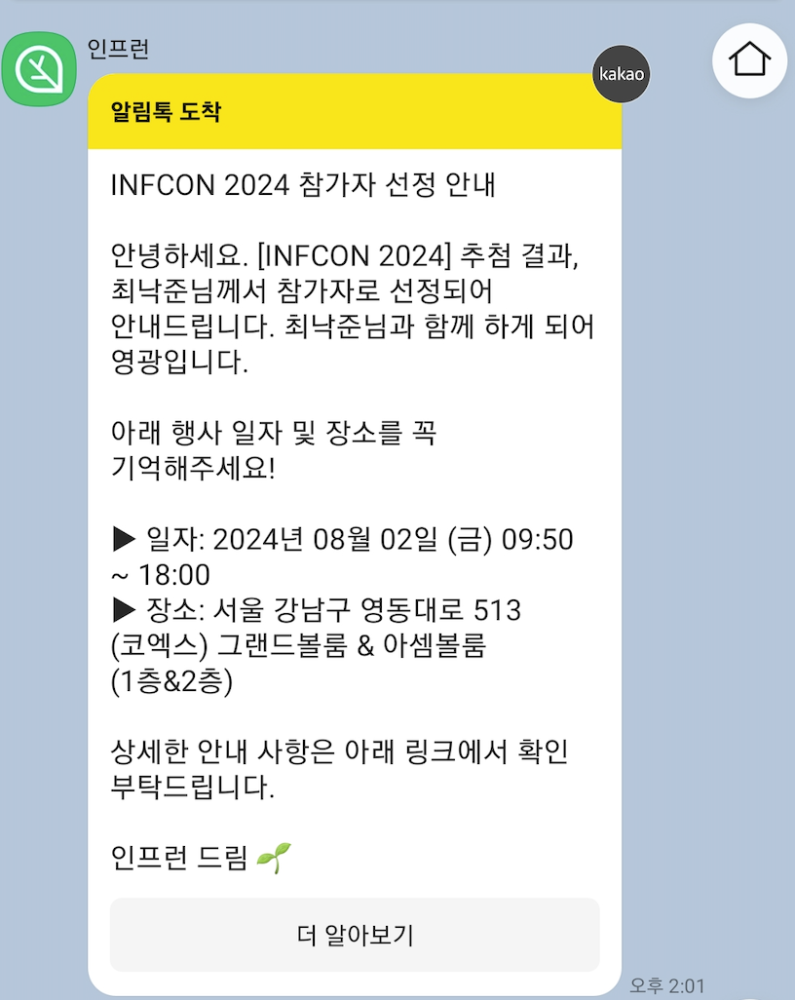

# 인프콘 2024 후기

재작년부터 가보고 싶었지만 떨어졌던 인프콘

올해는 나도 당첨!

---
## 도착
인프콘 시작은 오전 10시부터인데 나는 9시에 도착했다.   
현재 운영 중인 개발자 커뮤니티(밋코더) 사람들과 먼저 만나기로 했기 때문이다.  

도착하니 사람이 꽤나 북적였다. 밋코더 사람들과 만나서 얘기좀 나누고 주변 구경좀 하다 보니  
금방 10시가 되고 인프콘 개막식이 열렸다. 

## 기업 부스

인텔리제이, 데이터독, 무신사, 여기어때 등등등 아주 많은 기업들의 기업 부스가 준비되어 있었다.  
솔직히 기업에서 준비한 내용보다는 **굿즈나 경품 받는게** 제일 좋다.  

거의 모든 부스를 시간 날때마다 다 돌았는데, 운이 따라 주지 않아 좋은 건 하나도 못 건졌다.  
특히 무신사에서 주는 티셔츠가 매우 탐났는데 50% 확률임에도 불구하고 꽝...  
스티커나 사탕 같은 건 정말 많이 받았다..ㅋㅋ
  

## 세션

*(내가 들은 세션들)*

*오브젝트* 저자 조용호 님이나 *토비 스프링*의 토비님이 준비하신 세션도 있었지만  
개인적으로는 흥미가 없어서 듣지 않았다.(하지만 두 세션이 역시 가장 인기가 많았다.)

내가 들었던 것들 중 가장 좋았던 것은 의외로 가볍게 들었던 아래 두 세션 이었다. 

- 기술 서적 집필은 처음이라 by 김가람 님
- 사이드 프로젝트로 커리어 레벨업! by 조현우 님

### 1. 기술 서적 집필은 처음이라 by 김가람 님

평소에 막연히 `기술 서적을 쓰는 사람들은 어떤 사람들이고 어떻게 책을 낼까?`라는 궁금증을 가지고 있었다.  
세션에서는 사내에서 사람들과 공유를 위해 글을 쓰는 것으로 시작하여  
이를 책으로 내기까지의 과정을 솔직하면서도 재미있게 들려주었다.  

이미 많은 것을 이룬 사람이 거창하게 준비해서 책을 쓴 것이 아니라,  
주니어임에도 불구하고 남에게 도움 될만한 주제를 찾고, 이를 위해 2년간 노력 하여  
책을 완성한 것이 참 멋지다고 느껴졌다.  

그리고 이 세션에서 전하는 메시지는 비단 서적 집필에 국한 된 것이 아니라,  
다양한 분야에도 적용되는 것이라고 생각 되어 더욱 기억에 남았다.

### 2. 사이드 프로젝트로 커리어 레벨업! by 조현우 님

이 세션에서는 1년에 12개의 사이드 프로젝트를 진행하여  
php개발자에서 react 개발자가 되기 까지의 과정을 들을 수 있었다.

개발자들은 사이드 프로젝트에 대해 관심도 많고 고민도 많을 것이다.  
그런데 조현우님의 사이드 프로젝트에 대한 접근법이 상당히 흥미로웠다.  
`사이드 프로젝트는 무조건 2일만에 끝내고, 일단 만들어서 배포해보라`는 것이었다.  
(그 이유는 나중에 유튜브에 올라오면 영상 참고!)

아무튼 사이드 프로젝트로 성장하는 좋은 방법을 배우게 된 세션이었던 것 같다.

## 네트워킹 파티

오후가 되어 네트워킹 파티 세션이 열려 참여해 보았다.
네트워킹 파티에는 테이블이 여러개가 있고 테이블마다 주제가 있어서 (백엔드 개발, 커리어, 프론트 개발 등)  
해당 주제에 관심있는 사람들끼리 모여 얘기를 나누는 자리이다.  
사실 나는 인프콘에서 지인들을 생각 보다 많이 만나게 되어 주로 아는 사람들과 시간을 보냈다.  

그러다가 다른 사람과도 교류해 봐야지 싶어서 배회하고 있으니  
인프콘 스태프 분들이 도와주셔서 이곳 저곳 껴주셨다.(ㅋㅋ)  

근데 내가 I이기도 하고, 생각보다 막상 특정 주제에 대해서 할말이 없기도 했다   
그래서 그냥 옆사람들한테 '세션 뭐 들으셨어요?', '무신사 티셔츠 받으셨어요?'  
등등 그냥 가벼운 얘기를 하면서 돌아 다녔다. 그래도 나름 재밌던 것 같다.    

## 후기
무신사 티셔츠 못받은 건 아쉽지만  
젯브레인 양말은 건졌다(꽤 멋있다)
