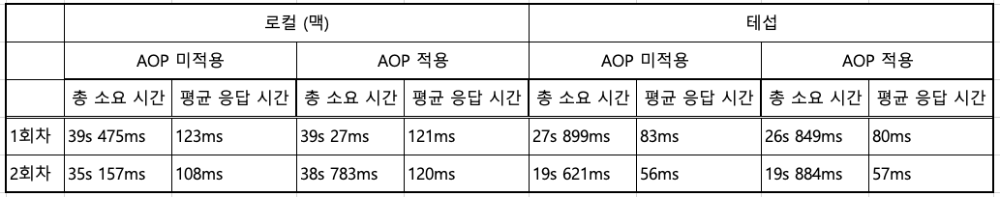
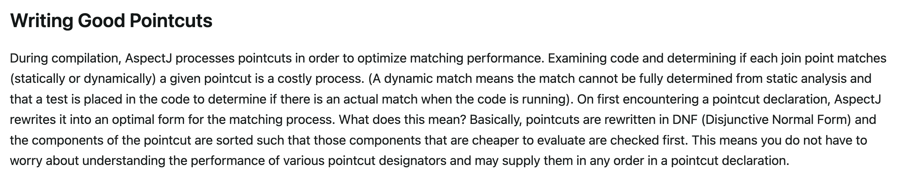

# 공통 로깅 기능에 AOP 적용하기 + 성능 테스트

## 0. 개요
회사에서 진행 중인 프로젝트에 AOP를 적용할만 한 기능이 있어, 이 부분에 대해 스프링 AOP를 적용해 보려 한다.  
더불어, [이전 글](https://velog.io/@rockpago/%EC%8A%A4%ED%94%84%EB%A7%81-AOP-%ED%8F%AC%EC%9D%B8%ED%8A%B8%EC%BB%B7-%EA%B5%AC%ED%98%84-%EC%8B%9C-%EC%84%B1%EB%8A%A5-%EC%B0%A8%EC%9D%B4)
에서 살펴봤던 `포인트컷의 성능이슈`에 대해서도 직접 테스트하여 확인 해보려 한다.

## 1. 요구 사항
스프링AOP를 이용하여 Controller에서 요청이 들어 올 때 자동으로 로그를 남긴다.
1. 로그에는 (1)메서드 이름 (2) 메서드 파라미터 를 출력한다.
2. 민감 정보는 마스킹한다.
3. 어노테이션이 적용된 메서드에**만** 로그를 남긴다. (로깅이 불필요한 경우를 위해)


## 2. 구현
(1) 커스텀 어노테이션을 생성한다. 이 어노테이션이 있을 경우에만 로그를 출력할 것이다.
```java
@Target(ElementType.METHOD)
@Retention(RetentionPolicy.RUNTIME)
public @interface MyCustomAnnotation {
}
```

(2) Aspect 구현부이다.  
@MyCustomAnnotation이 붙었을 경우 작동하고, joinPoint를 통해 메서드 시그니처를 불러와  
필요한 로그를(메서드 이름, 파라미터 이름, 인자 등) 출력한다.
```java
@Aspect
@Component
@Slf4j
public class TestAspect {
    
    //민감 필드를 선언한다. 파라미터 이름이 이에 해당할 경우 마스킹처리를 한다. 
    private static final Set<String> SENSITIVE_FIELDS = new HashSet<>(List.of("password, token, apikey"));

    @Before("@annotation(com.test.MyCustomAnnotation)")
    public void httpRequestLogger(JoinPoint joinPoint) {
        String methodName = joinPoint.getSignature().getName();

        Object[] args = joinPoint.getArgs();
        MethodSignature signature = (MethodSignature) joinPoint.getSignature();
        String[] parameterNames = signature.getParameterNames();

        log.info("Method[{}], Args[{}] ", methodName, buildParam(parameterNames, args));
    }

    private String buildParam(String[] parameterNames, Object[] args) {
        // 파라미터 이름, 파라미터 출력
        // 민감정보는 마스킹 처리
        // 이하 생략...
    }
}
```
## 3. 성능 이슈?
[이전 글](https://velog.io/@rockpago/%EC%8A%A4%ED%94%84%EB%A7%81-AOP-%ED%8F%AC%EC%9D%B8%ED%8A%B8%EC%BB%B7-%EA%B5%AC%ED%98%84-%EC%8B%9C-%EC%84%B1%EB%8A%A5-%EC%B0%A8%EC%9D%B4)
에서 포인트컷을 contextual지정자로 설정 시 (어노테이션이나 메서드 인자 등이 이에 해당)  
스프링 빈 초기화 시점에 어느 어드바이스를 적용할지 판단할 수 없기 때문에  
판단하는 과정이 런타임에 일어나게 되고  
따라서 성능상 좋지 않다고 했다.  

이번 예제에서는 포인트컷을 어노테이션을 사용한 데다  @annotation(com.test.MyCustomAnnotation)  
joinPoint를 통해 메서드 시그니처를 리플렉션으로 불러오기에  
딱 이전글에서 말한 안티패턴에 해당된다.  

그렇다면 스프링 문서에 나온데로 성능이슈를 겪게 될까?

## 4. 테스트 및 검증
간단하게 테스트 결과를 보도록 하겠다.  


간단한 GET 요청을 500회 했을 때의 결과이다.
총 10번 가깝게 테스트를 해보았는데 대부분 500회 기준으로 약 1초 정도의 차이밖에 나지 않았다.

**즉, 어노테이션이나 인자로 포인트컷을 선언해도 성능 상 불이익이 정말 미미하다.**


## 5. 왜 그럴까?
스프링 공식 문서에서 contextual 지정자는 느리다고 했는데,  
왜 실제로는 거의 차이가 나지 않을까? 그 이유 역시 스프링 공식 문서에서 확인할 수 있다.  

요약하자면 포인트컷 매칭은 비용이 큰 과정이지만,  
AspectJ는 이를 해결하기 위해 DNF라는 자체 형식으로 포인트컷을 재정의하고,  
결론적으로 정렬과 평가 알고리즘을 통해 자체적으로 최적화 한다는 내용이다.  

`즉 AspectJ가 자체적으로 최적화를 한다는 것이다.`(그리고 그 효과는 대단했다.)  
따라서 생각보다 성능상 이슈가 미미한 거이다.  

생각해보면 Spring 자체에서 이미 contextual 지정자를 많이 사용 중이다.  
@Transactional(readOnly = true) 와 같이 찾아 보면 정말 많이 사용 중이다.  
이게 가능한 이유가 결국 AspectJ가 자체적인 최적화를 통해 성능적 이슈를 해결하고 있기 때문이라고 볼 수 있을 것 같다.

## 6. 진짜 결론

이론적으로 포인트컷에서 어노테이션, 인자 등의 contextual 사용자를 사용하는 것은 좋지 않지만,  
실제로 AspectJ가 최적화를 하기 때문에 크게 상관 없다. (이미 스프링도 그렇게 사용하고 있다)


